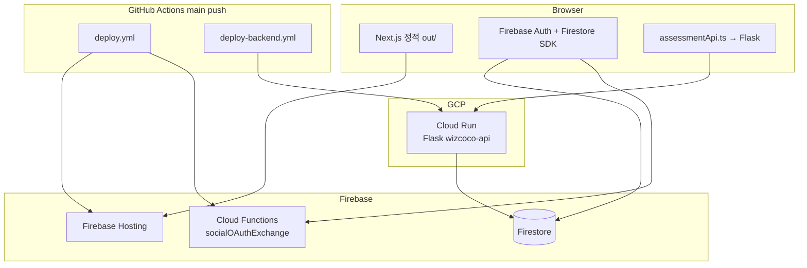

# WizCoCo 프로젝트 참조 가이드 (신규 프로젝트 제작용)

> **목적**: WizCoCo의 구상·구성·운영 방식을 그대로 참고하여 유사 서비스를 만들 때 필요한 사항, 주의점, 핵심 패턴을 한 문서로 정리합니다.  
> **대상 독자**: 새 프로젝트 기획·설계·구현 담당자, AI 에이전트 프롬프트 첨부용  
> **기준 저장소**: WizCoCo (`psych-test` 패키지명, Firebase 프로젝트 `wiz-coco`)  
> **프로덕션 URL**: https://wiz-coco.web.app

---

## 1. 서비스 개념 요약

### 1.1 도메인

**심리 검사·심리 케어 플랫폼**입니다. 다음 역할과 흐름이 중심입니다.

| 역할 | 설명 |
|------|------|
| **내담자(user)** | 검사 참여, 결과 조회·수정, 마이페이지 |
| **상담사(counselor)** | 검사코드(accessCode) 세트 생성·관리, 내담자 진행 현황 조회 |
| **관리자(admin)** | 사용자·구독·시스템 관리, Firestore 전권 |

### 1.2 핵심 비즈니스 객체

1. **검사코드(accessCode)**  
   상담사가 발급하는 세트 식별자. 내담자는 코드로 세트에 참여하고, 포함된 여러 심리검사를 순차·선택 수행합니다.

2. **검사 세트(assessment)**  
   Firestore `assessments` 컬렉션. `title`, `testList`, `counselorId`, `status(active|archived)` 등.

3. **검사 결과(testResult)**  
   Firestore `testResults`. `accessCode`, `clientEmail`, `uid`, `responses`, `resultData` 등. 신규는 Firebase 로그인(Bearer) 소유, 레거시는 4자리 비밀번호(`passwordHash`) 병행.

4. **사용자 프로필**  
   Firestore `users/{uid}` — `role`, 이메일·표시명 등. **역할 판단은 이메일이 아니라 uid 문서의 `role` 필드**를 기준으로 합니다.

### 1.3 설계 철학 (반드시 이해할 점)

- **로컬 개발 서버(`npm run dev`)를 쓰지 않고**, 정적 빌드 + Firebase Hosting + GitHub Actions 배포를 기본으로 합니다.
- **단일 Next.js 앱**이지만, 런타임은 **3갈래**입니다: 정적 프론트(Hosting), Firestore 클라이언트 SDK, Flask API(Cloud Run).
- **Next.js API Routes는 소스에 존재하나 정적 배포에서는 동작하지 않습니다.** 서버 로직은 Flask 또는 Cloud Functions로 분리해야 합니다.
- **레거시 데이터·계정**을 전제로 한 **이메일/uid 연동(link-legacy)** 패턴이 내장되어 있습니다.

---

## 2. 전체 아키텍처

### 2.1 구성도



### 2.2 저장소 구조 (모노레포 아님)

단일 Git 저장소에 **배포 단위가 여러 개** 공존합니다.

| 경로 | 역할 |
|------|------|
| `src/` | Next.js 14 App Router 프론트엔드 |
| `public/` | 정적 자산 |
| `backend/` | Flask REST API (Python 3.10+, Cloud Run) |
| `functions/` | Firebase Cloud Functions (Node 20, TypeScript) |
| `scripts/` | 빌드·검증·마이그레이션·배포 보조 |
| `docs/` | 운영·연동·보안 문서 |
| `.github/workflows/` | CI/CD |
| `githooks/` | 커밋 후 자동 `git push` (선택) |
| `.cursor/rules/` | Cursor 에이전트 규칙 |

**주의**: `psych-test/` 등 중첩 `package-lock.json`이 남아 있을 수 있음 — 신규 프로젝트에서는 초기부터 단일 루트만 유지 권장.

### 2.3 기술 스택

| 계층 | 기술 |
|------|------|
| 프론트 | Next.js 14 (`output: 'export'`), React 18, TypeScript, Tailwind, MUI |
| 인증 | Firebase Authentication (이메일, Google, 카카오·네이버 OAuth) |
| DB | Firestore (주), PostgreSQL/Prisma는 의존성만 있고 스키마 미사용 |
| API | Flask 3 + firebase-admin + gunicorn |
| 서버리스 | Firebase Functions (OAuth 토큰 교환 등) |
| 호스팅 | Firebase Hosting (`out/`) |
| API 호스팅 | Google Cloud Run (`asia-northeast3`) |
| CI/CD | GitHub Actions (프론트·백엔드 **별도 워크플로**) |

---

## 3. 프론트엔드 구성 (핵심만)

### 3.1 Next.js 정적보내기

`next.config.js` 필수 설정:

- `output: 'export'` — 빌드 산출물 `out/`
- `trailingSlash: true` — Hosting·SPA rewrite와 맞춤
- `images.unoptimized: true`
- 클라이언트 번들에서 **서버 전용 모듈 제외**: `firebase-admin`, `next-auth`, `pg`, `@prisma/client`, `bcrypt` 등

**의미**: SSR, ISR, Middleware에서의 서버 인증, API Route 런타임을 **사용할 수 없습니다.**

### 3.2 라우팅·Hosting 연동

- App Router: `src/app/**/page.tsx`
- `firebase.json`의 `rewrites`로 SPA 폴백 및 특정 경로(`admin`, `mypage`, `tests/*`)를 `index.html`로 연결
- `/api/social-oauth`만 Cloud Function으로 라우팅

### 3.3 인증·세션

| 구성 요소 | 경로·역할 |
|-----------|-----------|
| 전역 Provider | `src/contexts/FirebaseAuthContext.tsx` |
| 앱 셸 | `src/components/AppChrome.tsx` |
| 계정 통합 | `src/utils/accountIntegration.ts` (`AccountIntegrationManager`) |
| Custom Token 로그인 | `src/lib/firebaseCustomTokenSignIn.ts` |
| Firebase 초기화 | `src/lib/firebase.ts`, `src/lib/firebaseClientConfig.ts` |
| 역할 유틸 | `src/utils/roleUtils.ts` (`user` \| `counselor` \| `admin`) |

로그인 성공 후 흐름(요지):

1. Firebase Auth 세션 확립  
2. `POST {FLASK}/api/auth/link-legacy-data` — 이메일 기준 레거시 `testResults` uid 연결  
3. `POST {FLASK}/api/auth/bootstrap-role` — 설정된 관리자·상담사 이메일에 role 부여  

### 3.4 Flask API 클라이언트

- 모듈: `src/lib/assessmentApi.ts`
- URL 우선순위: `NEXT_PUBLIC_FLASK_API_URL` → (production 시) `window.location.origin` → `http://localhost:5000`
- 상담사 API: `Authorization: Bearer <Firebase ID Token>`

상세: `docs/FRONTEND_FLASK_INTEGRATION.md`

### 3.5 소셜 로그인

- Google: 클라이언트 OAuth + Firebase  
- 카카오·네이버: `functions/oauthExchange.ts` → Hosting rewrite `/api/social-oauth`  
- 콜백 페이지: `src/app/login/*-callback/`

---

## 4. 백엔드 구성

### 4.1 Flask API

- 진입: `backend/app.py` (blueprints: assessments, auth, results)
- 인증 미들웨어: `backend/auth_middleware.py` — Bearer Firebase ID Token 검증
- 설정: `backend/config.py` — 컬렉션명, bootstrap 이메일, rate limit, CORS
- 배포: `backend/cloudbuild.yaml` → Cloud Run 서비스 `wizcoco-api`

### 4.2 주요 API 그룹

| 구분 | 인증 | 예시 |
|------|------|------|
| 상담사 | Bearer | CRUD `/api/assessments`, `/progress` |
| 내담자 공개 | 없음 | `POST /api/assessments/public/lookup` |
| 결과 | Bearer (신규) / password (레거시) | `/api/results`, `/api/results/mine` |
| 계정 | Bearer | `/api/auth/link-legacy-data`, `/api/auth/bootstrap-role` |
| 헬스 | 없음 | `GET /api/health` |

### 4.3 검사코드 규칙

- 신규: CVC(자음-모음-자음, L/I/O 제외) + 숫자 2~9만, **3자리부터**, 조합 부족 시 4·5자리 확장
- 레거시: 영숫자 6자리 호환
- 형식·마이그레이션: `src/lib/accessCodeFormat.ts`, `src/lib/inspectionCodeMigration.ts`, `backend/scripts/migrate_strip_code_hyphens.py`

### 4.4 Firebase Cloud Functions

- `functions/index.ts`: `socialOAuthExchange`, `api`, `processLogs`
- Runtime: Node 20 (`firebase.json`)

---

## 5. 데이터·보안 모델

### 5.1 Firestore 컬렉션 (주요)

| 컬렉션 | 용도 |
|--------|------|
| `users` | 프로필·role (클라이언트 생성 시 role은 `user`만, role 승격은 admin 또는 bootstrap) |
| `assessments` | 상담사 검사코드 세트 |
| `testResults` | 검사 결과 (uid 소유·상담사 assessment 연계·admin) |
| `subscriptions`, `paymentHistory`, `counselorApplications` | 구독·결제·상담사 신청 |

### 5.2 Firestore Rules 원칙

- **클라이언트 직접 쓰기는 제한적** — `assessments` 공개 lookup은 **Flask(Admin SDK)**에서 처리
- `testResults` 생성은 본인 uid만; 상담사·대량 쓰기는 **백엔드 Admin SDK**
- `system_meta` 등 민감 메타는 클라이언트 차단
- 규칙 파일: `firestore.rules`, 인덱스: `firestore.indexes.json`

### 5.3 검사 결과 저장 (하이브리드 — 중요)

현재 구현은 **LocalStorage 우선 + Firestore 부분 연동**입니다.

- 많은 검사 완료 로직이 `localStorage`에만 저장
- Firestore 저장·동기화 큐(`offlineQueue`, `syncService`)는 일부 검사·페이지에만 연결
- 신규 프로젝트에서 **처음부터 단일 소스(Firestore 또는 Flask API)로 통일**하는 것을 강력 권장

참고: `docs/TEST_RESULT_STORAGE_ANALYSIS.md`

### 5.4 레거시·계정 연동

| 수단 | 설명 |
|------|------|
| 로그인 후 자동 | `FirebaseAuthContext` → `link-legacy-data` |
| 수동 스크립트 | `backend/scripts/link_legacy_by_email.py` |
| 레거시 결과 비밀번호 | bcrypt `passwordHash`, 신규 제출에는 미사용 |

---

## 6. 배포·CI/CD (제작 시 필수 체크리스트)

### 6.1 배포 정책

- **`main` 브랜치 push → GitHub Actions 자동 배포** (로컬 `firebase deploy` / `npm run dev`는 의도적으로 비활성 메시지)
- 프론트: `.github/workflows/deploy.yml` — lint → tsc → jest → build → Firebase hosting+functions
- 백엔드: `.github/workflows/deploy-backend.yml` — Cloud Build → Cloud Run
- `concurrency`로 동일 브랜치 연속 push 시 이전 실행 취소

### 6.2 GitHub Secrets (프론트 빌드·배포)

**Firebase 클라이언트 (`NEXT_PUBLIC_*`)**

- `NEXT_PUBLIC_FIREBASE_API_KEY`
- `NEXT_PUBLIC_FIREBASE_AUTH_DOMAIN`
- `NEXT_PUBLIC_FIREBASE_PROJECT_ID`
- `NEXT_PUBLIC_FIREBASE_STORAGE_BUCKET`
- `NEXT_PUBLIC_FIREBASE_MESSAGING_SENDER_ID`
- `NEXT_PUBLIC_FIREBASE_APP_ID`
- `NEXT_PUBLIC_FIREBASE_MEASUREMENT_ID`

**필수 연동**

- `NEXT_PUBLIC_FLASK_API_URL` — Cloud Run URL (**Hosting에 API 프록시가 없으므로 빌드 시 반드시 주입**)
- `FIREBASE_SERVICE_ACCOUNT`, `FIREBASE_TOKEN`
- 소셜: `KAKAO_*`, `NAVER_*`, `GOOGLE_*` (Functions·OAuth)

**백엔드 배포**

- `GCP_PROJECT_ID`, `GCP_SA_KEY` (Cloud Run Admin, Artifact Registry Reader 등)

상세: `docs/github-secrets-complete-setup.md`, `src/env.example`, `backend/.env.example`

### 6.3 CORS

Flask `CORS_ORIGINS`에 최소 다음 포함:

- `https://<project>.web.app`
- 커스텀 도메인 사용 시 해당 HTTPS 오리진

### 6.4 배포 후 검증

1. Hosting URL 로드  
2. `curl {FLASK_URL}/api/health`  
3. 로그인 → role bootstrap → 상담사 검사코드 생성 → 내담자 lookup  
4. 브라우저 Network에서 Flask 요청이 **올바른 Cloud Run URL**로 가는지 확인  

---

## 7. 환경 변수·설정 패턴

### 7.1 로딩 우선순위

1. CI: `deploy.yml`에서 `.env` 파일 생성 후 `npm run build`  
2. 로컬: `.env`, `.env.local`, `.env.production`  
3. 검증: `npm run verify-env` (`scripts/verify-env.js`)

### 7.2 `NEXT_PUBLIC_*` 규칙

- 브라우저에 노출되는 값만 `NEXT_PUBLIC_` 접두사  
- Flask URL, Firebase 클라이언트 키, 소셜 REST API 키(카카오) 등  
- Admin SDK private key는 **절대** `NEXT_PUBLIC_` 금지

### 7.3 Flask `.env` (로컬·Cloud Run)

- `FIREBASE_CREDENTIALS_PATH` 또는 `GOOGLE_APPLICATION_CREDENTIALS`
- `CORS_ORIGINS`, `SECRET_KEY`, `BOOTSTRAP_ADMIN_EMAILS`, `BOOTSTRAP_COUNSELOR_EMAILS`
- `RATE_LIMIT_ACCESS_CODE`, `RATE_LIMIT_PASSWORD_API`

---

## 8. 주의해야 할 사항 (실패·보안·운영)

### 8.1 아키텍처 함정

| 함정 | 설명 | 대응 |
|------|------|------|
| API Route 착각 | `src/app/api/**`가 있어도 정적 Hosting에서는 **실행 안 됨** | 서버 로직은 Flask/Functions로 |
| Flask URL 누락 | `firebase.json`에 Cloud Run rewrite 없음 | CI에서 `NEXT_PUBLIC_FLASK_API_URL` 필수 |
| `next.config.js` 하드코딩 | Firebase 클라이언트 값이 config에 박혀 있으면 Secrets-only 정책과 충돌 | env·CI 주입만 사용하도록 신규 프로젝트 설계 |
| 이중 저장소 | localStorage + Firestore 혼재 | 도메인별 단일 저장 전략 수립 |
| Prisma/pg 잔재 | webpack fallback으로만 제외, 실제 미사용 | 신규 시 제거해 복잡도 감소 |

### 8.2 보안

- Firestore Rules와 **Admin SDK 우회 경로**를 항상 쌍으로 설계  
- 레거시 `passwordHash` API는 rate limit 적용 (`limit_password_api`)  
- bootstrap admin/counselor 이메일은 **환경 변수로만** 관리, 코드 하드코딩 금지  
- 서비스 계정 JSON은 GitHub Secrets·GCP Secret Manager에만 보관  
- 참고: `docs/SECURITY_CREDENTIALS.md`, `docs/CREDENTIAL_SETUP_AND_ROTATION_KO.md`

### 8.3 인증·OAuth

- 카카오·네이버는 **Functions에서 client_secret 처리** (브라우저에 secret 노출 금지)  
- `NEXT_PUBLIC_SOCIAL_AUTH_URL` 또는 Hosting rewrite 일관성 유지  
- `Cross-Origin-Opener-Policy: same-origin-allow-popups` (popup OAuth용, `firebase.json` headers)

### 8.4 역할·권한

- UI 메뉴·페이지 가드: `roleUtils` + Firestore `users/{uid}.role`  
- 클라이언트 role만 믿지 말 것 — Flask·Rules에서 재검증  
- 사용자가 스스로 `role`을 `admin`으로 올릴 수 없도록 Rules에 명시

### 8.5 운영·개발 문화

- 커밋 메시지: **영어 conventional** (`feat:`, `fix:`, `docs:` …) — `.cursorrules`  
- UI·주석: 한국어 다수  
- Cursor: 작업 후 `git push origin HEAD` (`.cursor/rules/git-push-after-edit.mdc`)  
- 로컬 훅: `git config core.hooksPath githooks` (선택)

---

## 9. 신규 프로젝트 제작 시 권장 순서

### Phase 0 — 요구사항 고정

- [ ] 역할 3종(user/counselor/admin) 필요 여부  
- [ ] 검사코드·세트·결과 모델 그대로 쓸지, 단순 단일 검사만 할지  
- [ ] 레거시 마이그레이션 필요 여부 (없으면 link-legacy·passwordHash 생략 가능)

### Phase 1 — 인프라

- [ ] Firebase 프로젝트 생성 (Auth, Firestore, Hosting, Functions)  
- [ ] GCP 프로젝트 + Cloud Run + Artifact Registry  
- [ ] GitHub 저장소 + Secrets 전체 등록 (`src/env.example` 기준)  
- [ ] `firestore.rules` / `firestore.indexes.json` 초안 배포

### Phase 2 — 백엔드 우선

- [ ] Flask 스켈레톤 (`app.py`, auth middleware, health)  
- [ ] Firebase Admin 초기화 + assessments/results/auth 라우트  
- [ ] Cloud Run 배포 워크플로 (`deploy-backend.yml` 참고)  
- [ ] CORS·헬스 확인

### Phase 3 — 프론트

- [ ] Next `output: 'export'` + `assessmentApi.ts`  
- [ ] `FirebaseAuthContext` + role bootstrap + (필요 시) link-legacy  
- [ ] `firebase.json` rewrites·headers  
- [ ] CI `deploy.yml`에서 `.env` 생성 후 build → hosting deploy

### Phase 4 — 인증 확장

- [ ] 이메일·Google  
- [ ] (선택) 카카오·네이버 Functions + callback 페이지

### Phase 5 — 도메인 기능

- [ ] 검사 페이지·결과 저장 **단일 경로로 통일**  
- [ ] 상담사 대시보드·진행률 API  
- [ ] 관리자 기능·구독(필요 시)

### Phase 6 — 품질

- [ ] Jest·ESLint·`tsc --noEmit` CI 포함 여부  
- [ ] `security-audit.yml`, 검사 데이터 검증 워크플로 (도메인별)  
- [ ] `docs/CODE_REVIEW_CHECKLIST.md` 수준의 체크리스트 작성

---

## 10. 핵심 파일 빠른 색인

| 영역 | 파일 |
|------|------|
| Next 설정 | `next.config.js` |
| Firebase Hosting | `firebase.json` |
| Firestore 규칙 | `firestore.rules` |
| Auth Context | `src/contexts/FirebaseAuthContext.tsx` |
| 계정 통합 | `src/utils/accountIntegration.ts` |
| Flask 앱 | `backend/app.py` |
| 프론트↔Flask | `docs/FRONTEND_FLASK_INTEGRATION.md` |
| 메인 CI | `.github/workflows/deploy.yml` |
| 백엔드 CI | `.github/workflows/deploy-backend.yml` |
| env 템플릿 | `src/env.example`, `backend/.env.example` |
| 검사 결과 분석 | `docs/TEST_RESULT_STORAGE_ANALYSIS.md` |
| Secrets 가이드 | `docs/github-secrets-complete-setup.md` |

---

## 11. 이 문서를 AI/팀에 첨부할 때 추천 프롬프트 문구

```
다음 WizCoCo 참조 가이드를 100% 준수하여 [새 서비스명]을 설계·구현해 주세요.

- Next.js는 output:'export' 정적 배포만 사용 (API Route 런타임 없음)
- 인증: Firebase Auth, 역할: Firestore users/{uid}.role
- 비즈니스 API: Flask on Cloud Run, 빌드 시 NEXT_PUBLIC_FLASK_API_URL 주입
- OAuth secret: Firebase Functions
- 배포: main push → GitHub Actions (hosting+functions / cloud run 분리)
- 검사 결과는 localStorage 혼용 없이 [Firestore|Flask] 단일 저장으로 설계
- 레거시 연동: [필요|불필요] — link-legacy-data 패턴

첨부: docs/PROJECT_REFERENCE_FOR_NEW_PROJECT.md
```

---

## 12. 관련 내부 문서 맵

| 주제 | 문서 |
|------|------|
| Flask 연동 | `docs/FRONTEND_FLASK_INTEGRATION.md` |
| Cloud Run 배포 | `docs/DEPLOY_CLOUD_RUN.md` |
| GitHub Secrets | `docs/github-secrets-complete-setup.md` |
| Firebase 클라이언트 | `docs/firebase-client-setup.md` |
| 카카오·네이버 OAuth | `docs/kakao-naver-oauth-setup.md` |
| 자격증명·로테이션 | `docs/CREDENTIAL_SETUP_AND_ROTATION_KO.md` |
| 코드 리뷰 | `docs/CODE_REVIEW_CHECKLIST.md` |
| 작업 계획 예시 | `docs/WORK_PLAN_1-5.md` |

---

*문서 버전: 2026-05-29 · WizCoCo 저장소 기준*
